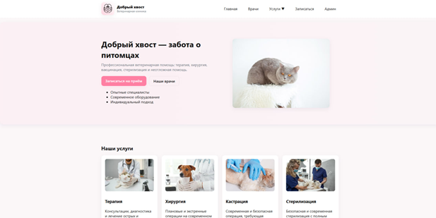
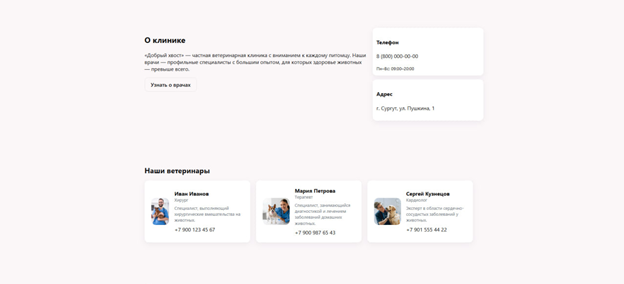
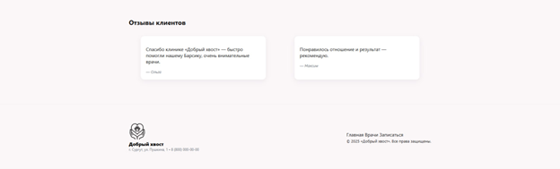
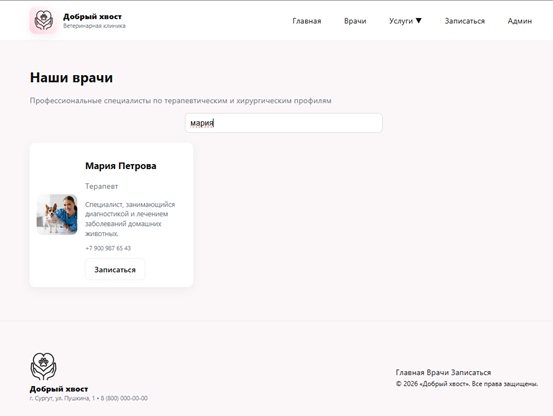
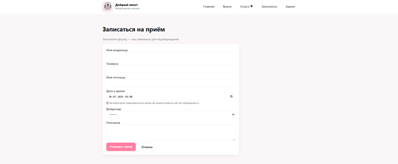

# 🐾 Добрый хвост

Веб-приложение ветеринарной клиники, разработанное на **Python + Django**.

Проект создан в рамках изучения веб-разработки и представляет собой многостраничный сайт ветеринарной клиники с возможностью просмотра информации о врачах, поиска специалистов и записи на приём.

---

## ✨ Возможности

- 🏥 Главная страница клиники
- 👨‍⚕️ Каталог ветеринарных врачей
- 🔍 Поиск врачей по имени и специальности
- 📅 Онлайн-запись на приём
- ✅ Клиентская валидация формы записи
- ⚙️ Django Admin для управления данными
- 📱 Адаптивный интерфейс для мобильных устройств
- ⬆️ Кнопка быстрого возврата наверх

---

## 🛠️ Используемые технологии

- Python
- Django
- SQLite
- HTML5
- CSS3
- JavaScript
- Git

---

## 🚀 Запуск проекта

```bash
git clone https://github.com/driplesnader/vet-clinic-django

cd vet-clinic-django

python -m venv .venv

# Windows
.venv\Scripts\activate

pip install -r requirements.txt

python manage.py migrate

python manage.py runserver
```

После запуска проект будет доступен по адресу:

```
http://127.0.0.1:8000/
```

---

## 📂 Структура проекта

```
clinic/          # настройки Django-проекта
vetclinic/       # основное приложение
templates/       # HTML-шаблоны
static/          # CSS, JavaScript и изображения
screenshots/     # скриншоты проекта
manage.py
requirements.txt
```

---

## 📸 Скриншоты проекта

### 🏠 Главная страница и услуги




### ℹ️ Информация о клинике и врачи




### 💬 Отзывы и контакты




### 👨‍⚕️ Поиск врачей




### 📅 Запись на приём



---

## 🔮 Возможные улучшения

- переход на PostgreSQL;
- реализация REST API через Django REST Framework;
- добавление автоматических тестов;
- деплой проекта;
- контейнеризация через Docker;
- расширение пользовательского функционала.

---

## 👩‍💻 Автор

Проект разработан в рамках обучения веб-разработке на Django.

Изучаю Python, Django, SQL, Git и современные подходы к созданию веб-приложений.
